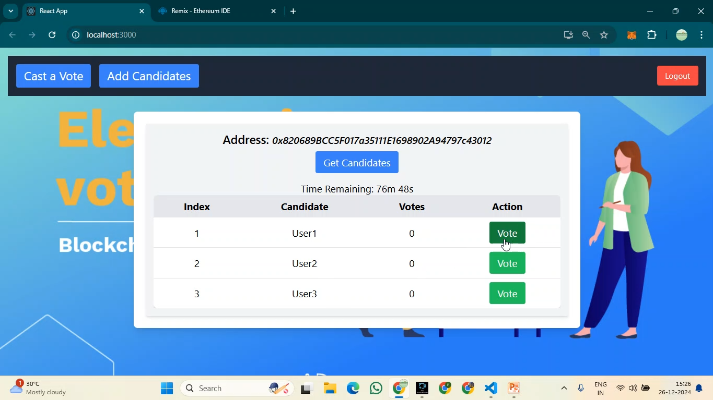
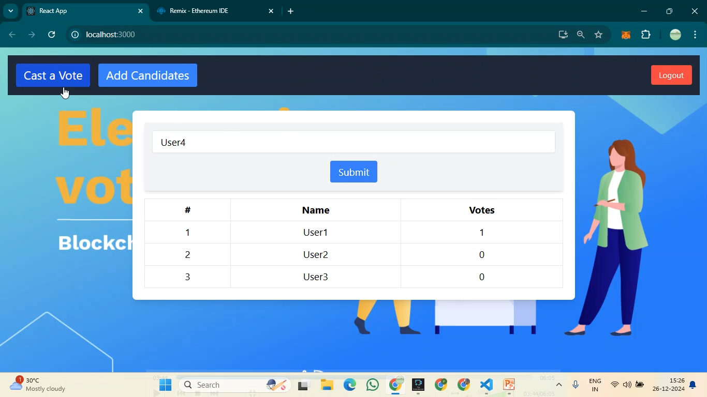

---

## 🗳️ Decentralized Online Voting System using Blockchain

A secure, transparent, and tamper-proof **online voting platform** built on Ethereum blockchain using **Solidity** for smart contracts and **React** for frontend UI.

> ✅ Ideal for colleges, small organizations, or events seeking fair digital elections.

---

### 🔐 Key Features

* **🧾 Voter Authentication**: Each wallet can vote only once.
* **🏛️ Candidate Management**: Add and view multiple candidates with party name.
* **⏳ Voting Window**: Voting is allowed only between `votingStart` and `votingEnd` timestamps.
* **📊 Real-Time Results**: Transparent vote count updates after every transaction.
* **🚫 Tamper-Proof**: Once deployed, no one can alter votes or candidate list.

---

### 🧱 Smart Contract (Solidity)

```solidity
struct Candidate {
    uint id;
    string name;
    string party;
    uint voteCount;
}

mapping (uint => Candidate) public candidates;
mapping (address => bool) public voters;

function vote(uint candidateID) public {
    require((votingStart <= now) && (votingEnd > now));
    require(!voters[msg.sender]);
    voters[msg.sender] = true;
    candidates[candidateID].voteCount++;
}
```

✔️ Simple and gas-efficient voting logic
🛡️ Prevents double voting
🕒 Enforces voting deadlines

---

### 🖼️ Screenshots (Frontend - React + Ethers.js)

| Dashboard                          | Voting Panel                 | Results                        |
| ---------------------------------- | ---------------------------- | ------------------------------ |
|  |  |  |

---

### 🧰 Tech Stack

| Layer          | Tech                               |
| -------------- | ---------------------------------- |
| Smart Contract | Solidity, Remix, MetaMask          |
| Frontend       | React.js, TailwindCSS, Ethers.js   |
| Blockchain     | Ethereum (tested on local/testnet) |
| Hosting        | GitHub Pages / Vercel *(optional)* |

---

### 🚀 Getting Started (Local Setup)

1. **Clone the repository**

```bash
git clone https://github.com/your-username/decentralized-voting.git
cd decentralized-voting
```

2. **Install dependencies**

```bash
npm install
```

3. **Compile and deploy smart contract** (via Remix, Hardhat, or Truffle)

4. **Update contract ABI & address** in your React app

5. **Run the frontend**

```bash
npm start
```

---

### 🧠 Learning Outcomes

* Built a secure decentralized application (dApp)
* Understood Ethereum smart contracts and Web3 interactions
* Used MetaMask and wallets for real-time voting validation
* Developed React-based dashboard for voters and organizers

---

### 💡 Future Enhancements

* Role-based admin panel for adding candidates
* Wallet-based voter whitelist/blacklist
* IPFS for immutable vote receipts
* Mobile compatibility

---

### 👨‍💻 Author

**Pranav Ram**
🌐 [www.chennaisunday.com](https://www.chennaisunday.com)
📬 [pspranavram2005@gmail.com](mailto:pspranavram2005@gmail.com)
📽️ YouTube: *Final Year Project Tutorials*

---

Let me know if you want this adapted into a GitHub-ready format (with assets, markdown file), or combined with your existing codebase for live deployment.
